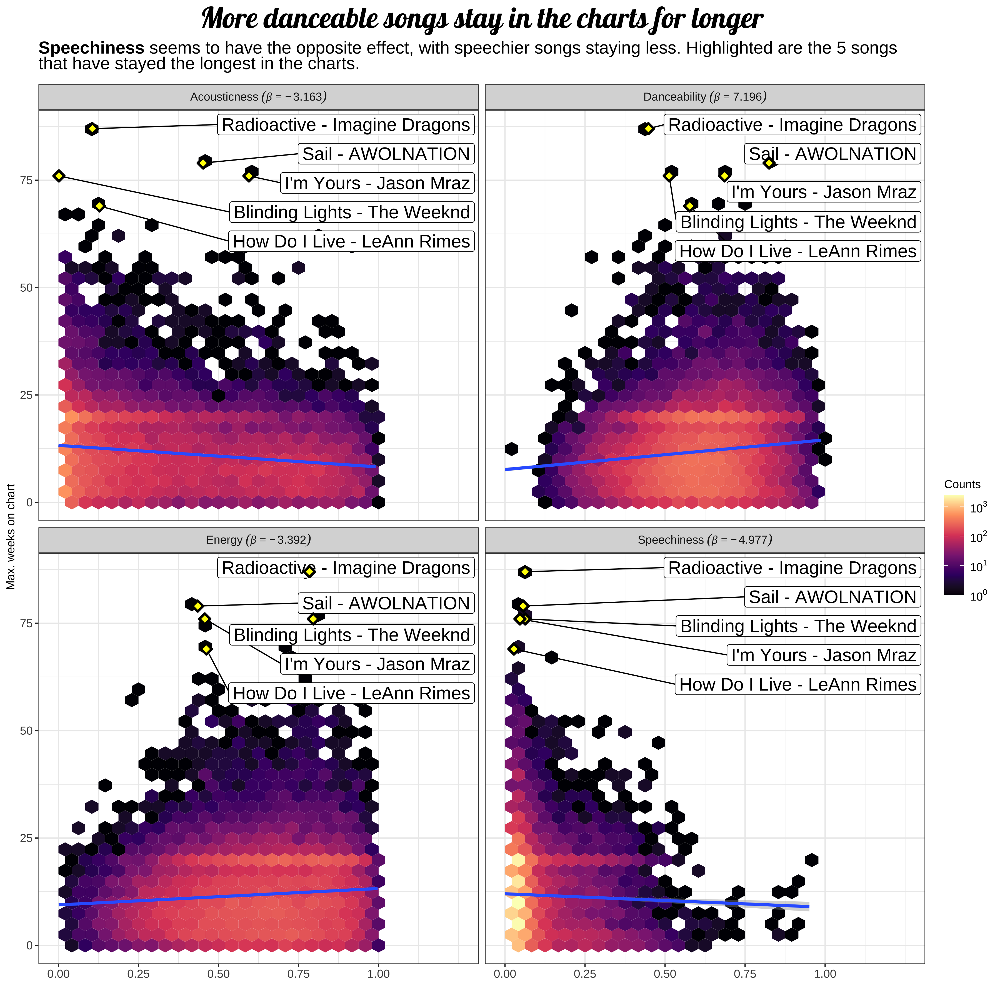

<h1 align='center'> 🧹 azTidyTuesday-almenal 📊 </h1>
My contributions to AstraZenca's azTidyTuesday initiative

- [Music features and Billboard charts](#billboard)
- [PhD's progression](#phd)
- [Gender ratios per industry](#gender_ratio)

---

<table border="0">
    <tr>
        <td style="text-align:center">
          <h3> <a name="billboard"> 🎶  </a> Music features and Billboard charts </h3>
        </td>   
        <td style="text-align:center">
        </td>     
        <td style="text-align:center">
          [<a href="azTidyTuesday_20220906_AlvaroMendoza/code.R">code</a>]
        </td>     
    </tr>
</table>

---

<table border="0">
    <tr>
        <td style="text-align:center">
          <h3> <a name="phd"> 🧑‍🔬 </a> PhD's progression </h3>
        </td>   
        <td style="text-align:center">
        </td>     
        <td style="text-align:center">
          [<a href="azTidyTuesday_20220510_AlvaroMendoza/tidyTuesday20220510.R">code</a>]
        </td>     
    </tr>
</table>

---

<table border="0">
    <tr>
        <td style="text-align:center">
          <h3> <a name="gender_ratio"> 👫 </a> Gender ratio per industry </h3>
        </td>   
        <td style="text-align:center">
        </td>     
        <td style="text-align:center">
          [<a href="azTidyTuesday_20220315_AlvaroMendoza/tidyTuesday20220315.R">code</a>]
        </td>     
    </tr>
</table>
